# TasteType · 口味人格测试

<p align="center">
  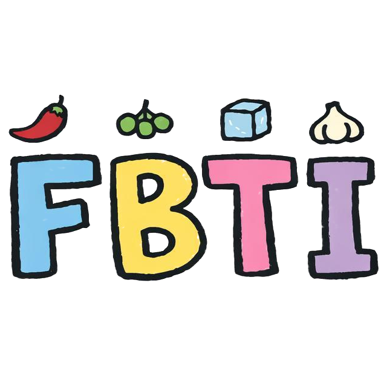
</p>

<p align="center">
  <strong>24 道情景题 · 发现你的味觉人格</strong>
</p>

<p align="center">
  <a href="https://github.com/kuicao55/FBTI">
    
  </a>
  
  
</p>

---

<p align="center">
  <a href="https://kuicao55.github.io/FBTI/">
    
  </a>
</p>

---

## 什么是 TasteType？

TasteType（口味人格测试）是一个基于食品感官科学的味觉人格测试，通过 **24 道情景选择题**识别你的四维味觉人格类型。

测试基于四个独立维度构建：

| 维度 | 代码 | 倾向 |
|:---|:---:|:---|
| **刺激偏好** | H / N / C / M | 灼烧 / 麻感 / 清凉 / 温和 |
| **核心味觉引力** | U / S / W / B / O | 鲜味 / 咸味 / 甜味 / 苦醇 / 酸味 |
| **风味构建哲学** | A / S | 加法烹饪 / 减法烹饪 |
| **新奇探索指数** | E / C | 探索者 / 经典派 |

> 你可以理解为 **食物版 MBTI** —— 四维味觉人格组合出 80 种独特类型。

---

## 80 种味觉人格一览

<div align="center">

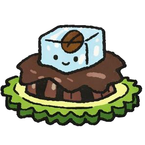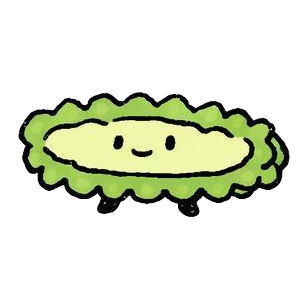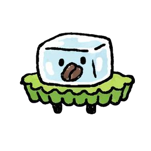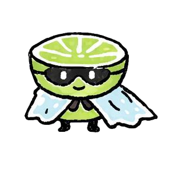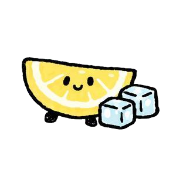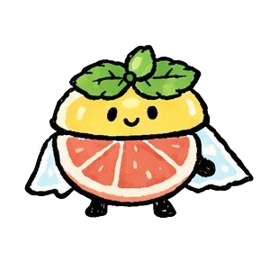
**CBAC**&nbsp;&nbsp;&nbsp;&nbsp;&nbsp;&nbsp;&nbsp;&nbsp;**CBAE**&nbsp;&nbsp;&nbsp;&nbsp;&nbsp;&nbsp;&nbsp;&nbsp;**CBSC**&nbsp;&nbsp;&nbsp;&nbsp;&nbsp;&nbsp;&nbsp;&nbsp;**CBSE**&nbsp;&nbsp;&nbsp;&nbsp;&nbsp;&nbsp;&nbsp;&nbsp;**COAC**&nbsp;&nbsp;&nbsp;&nbsp;&nbsp;&nbsp;&nbsp;&nbsp;**COAE**&nbsp;&nbsp;&nbsp;&nbsp;&nbsp;&nbsp;&nbsp;&nbsp;**COSC**&nbsp;&nbsp;&nbsp;&nbsp;&nbsp;&nbsp;&nbsp;&nbsp;**COSE**
凉茶原教旨&nbsp;&nbsp;苦凉炼金士&nbsp;&nbsp;苦瓜刺身党&nbsp;&nbsp;纯粹冰苦客&nbsp;&nbsp;传统酸梅汤卫队&nbsp;&nbsp;酸凉游侠&nbsp;&nbsp;简单柠檬水党&nbsp;&nbsp;果酸冰饮探险家

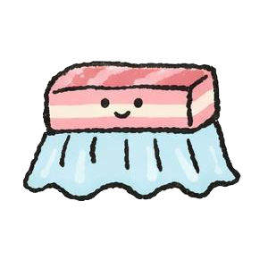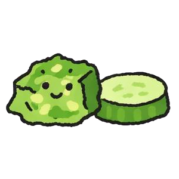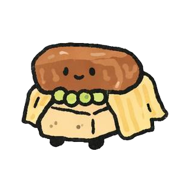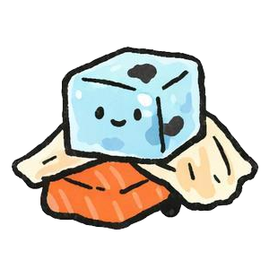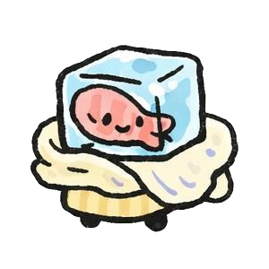
**CSAC**&nbsp;&nbsp;&nbsp;&nbsp;&nbsp;&nbsp;&nbsp;&nbsp;**CSAE**&nbsp;&nbsp;&nbsp;&nbsp;&nbsp;&nbsp;&nbsp;&nbsp;**CSSC**&nbsp;&nbsp;&nbsp;&nbsp;&nbsp;&nbsp;&nbsp;&nbsp;**CSSE**&nbsp;&nbsp;&nbsp;&nbsp;&nbsp;&nbsp;&nbsp;&nbsp;**CUAC**&nbsp;&nbsp;&nbsp;&nbsp;&nbsp;&nbsp;&nbsp;&nbsp;**CUAE**&nbsp;&nbsp;&nbsp;&nbsp;&nbsp;&nbsp;&nbsp;&nbsp;**CUSC**&nbsp;&nbsp;&nbsp;&nbsp;&nbsp;&nbsp;&nbsp;&nbsp;**CUSE**
传统凉菜卫道士&nbsp;&nbsp;咸凉探险家&nbsp;&nbsp;凉拌黄瓜党&nbsp;&nbsp;极简盐凉派&nbsp;&nbsp;凉卤死忠&nbsp;&nbsp;冰鲜炼金士&nbsp;&nbsp;纯粹冰鲜派&nbsp;&nbsp;冰鲜探险家

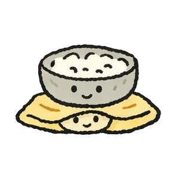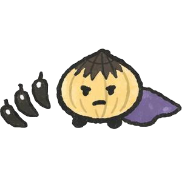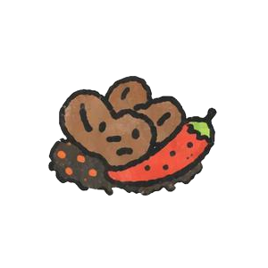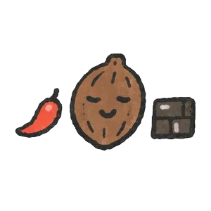
**CWAC**&nbsp;&nbsp;&nbsp;&nbsp;&nbsp;&nbsp;&nbsp;&nbsp;**CWAE**&nbsp;&nbsp;&nbsp;&nbsp;&nbsp;&nbsp;&nbsp;&nbsp;**CWSC**&nbsp;&nbsp;&nbsp;&nbsp;&nbsp;&nbsp;&nbsp;&nbsp;**CWSE**&nbsp;&nbsp;&nbsp;&nbsp;&nbsp;&nbsp;&nbsp;&nbsp;**HBAC**&nbsp;&nbsp;&nbsp;&nbsp;&nbsp;&nbsp;&nbsp;&nbsp;**HBAE**&nbsp;&nbsp;&nbsp;&nbsp;&nbsp;&nbsp;&nbsp;&nbsp;**HBSC**&nbsp;&nbsp;&nbsp;&nbsp;&nbsp;&nbsp;&nbsp;&nbsp;**HBSE**
传统冰品守护人&nbsp;&nbsp;甜凉魔术师&nbsp;&nbsp;单纯甜冰派&nbsp;&nbsp;薄荷甜心&nbsp;&nbsp;焦香辣味控&nbsp;&nbsp;苦辣隐士&nbsp;&nbsp;纯粹苦辣修行者&nbsp;&nbsp;黑巧辣客

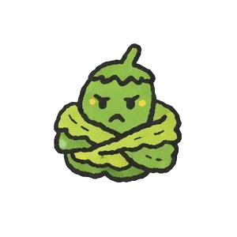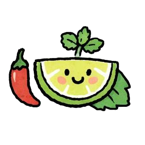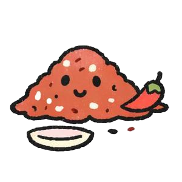
**HOAC**&nbsp;&nbsp;&nbsp;&nbsp;&nbsp;&nbsp;&nbsp;&nbsp;**HOAE**&nbsp;&nbsp;&nbsp;&nbsp;&nbsp;&nbsp;&nbsp;&nbsp;**HOSC**&nbsp;&nbsp;&nbsp;&nbsp;&nbsp;&nbsp;&nbsp;&nbsp;**HOSE**&nbsp;&nbsp;&nbsp;&nbsp;&nbsp;&nbsp;&nbsp;&nbsp;**HSAC**&nbsp;&nbsp;&nbsp;&nbsp;&nbsp;&nbsp;&nbsp;&nbsp;**HSAE**&nbsp;&nbsp;&nbsp;&nbsp;&nbsp;&nbsp;&nbsp;&nbsp;**HSSC**&nbsp;&nbsp;&nbsp;&nbsp;&nbsp;&nbsp;&nbsp;&nbsp;**HSSE**
发酵酸辣原教旨&nbsp;&nbsp;酸辣游民&nbsp;&nbsp;简单酸辣党&nbsp;&nbsp;清新酸辣使&nbsp;&nbsp;老卤死忠&nbsp;&nbsp;盐火游侠&nbsp;&nbsp;干碟党&nbsp;&nbsp;极简辣客

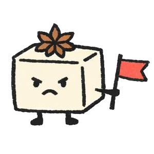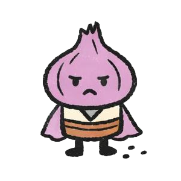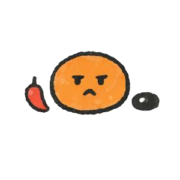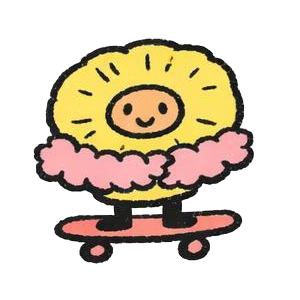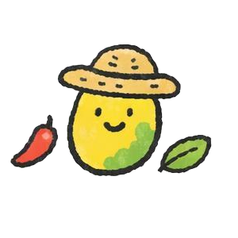
**HUAC**&nbsp;&nbsp;&nbsp;&nbsp;&nbsp;&nbsp;&nbsp;&nbsp;**HUAE**&nbsp;&nbsp;&nbsp;&nbsp;&nbsp;&nbsp;&nbsp;&nbsp;**HUSC**&nbsp;&nbsp;&nbsp;&nbsp;&nbsp;&nbsp;&nbsp;&nbsp;**HUSE**&nbsp;&nbsp;&nbsp;&nbsp;&nbsp;&nbsp;&nbsp;&nbsp;**HWAC**&nbsp;&nbsp;&nbsp;&nbsp;&nbsp;&nbsp;&nbsp;&nbsp;**HWAE**&nbsp;&nbsp;&nbsp;&nbsp;&nbsp;&nbsp;&nbsp;&nbsp;**HWSC**&nbsp;&nbsp;&nbsp;&nbsp;&nbsp;&nbsp;&nbsp;&nbsp;**HWSE**
红汤原教旨&nbsp;&nbsp;山野炼金士&nbsp;&nbsp;鲜辣清教徒&nbsp;&nbsp;都会熔炉&nbsp;&nbsp;糖醋辣星人&nbsp;&nbsp;甜辣发明家&nbsp;&nbsp;本味甜辣派&nbsp;&nbsp;果辣探险家


**MBAC**&nbsp;&nbsp;&nbsp;&nbsp;&nbsp;&nbsp;&nbsp;&nbsp;**MBAE**&nbsp;&nbsp;&nbsp;&nbsp;&nbsp;&nbsp;&nbsp;&nbsp;**MBSC**&nbsp;&nbsp;&nbsp;&nbsp;&nbsp;&nbsp;&nbsp;&nbsp;**MBSE**&nbsp;&nbsp;&nbsp;&nbsp;&nbsp;&nbsp;&nbsp;&nbsp;**MOAC**&nbsp;&nbsp;&nbsp;&nbsp;&nbsp;&nbsp;&nbsp;&nbsp;**MOAE**&nbsp;&nbsp;&nbsp;&nbsp;&nbsp;&nbsp;&nbsp;&nbsp;**MOSC**&nbsp;&nbsp;&nbsp;&nbsp;&nbsp;&nbsp;&nbsp;&nbsp;**MOSE**
传统烘焙苦行派&nbsp;&nbsp;黑金品鉴家&nbsp;&nbsp;极简苦行僧&nbsp;&nbsp;极简苦味旅人&nbsp;&nbsp;糖醋原教旨&nbsp;&nbsp;酸香探秘者&nbsp;&nbsp;简单酸味派&nbsp;&nbsp;果酸雅士

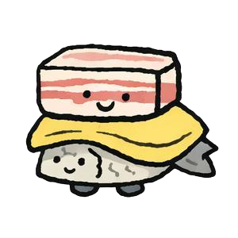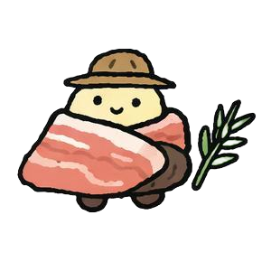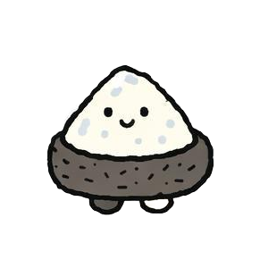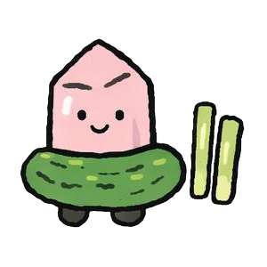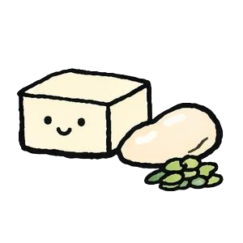
**MSAC**&nbsp;&nbsp;&nbsp;&nbsp;&nbsp;&nbsp;&nbsp;&nbsp;**MSAE**&nbsp;&nbsp;&nbsp;&nbsp;&nbsp;&nbsp;&nbsp;&nbsp;**MSSC**&nbsp;&nbsp;&nbsp;&nbsp;&nbsp;&nbsp;&nbsp;&nbsp;**MSSE**&nbsp;&nbsp;&nbsp;&nbsp;&nbsp;&nbsp;&nbsp;&nbsp;**MUAC**&nbsp;&nbsp;&nbsp;&nbsp;&nbsp;&nbsp;&nbsp;&nbsp;**MUAE**&nbsp;&nbsp;&nbsp;&nbsp;&nbsp;&nbsp;&nbsp;&nbsp;**MUSC**&nbsp;&nbsp;&nbsp;&nbsp;&nbsp;&nbsp;&nbsp;&nbsp;**MUSE**
老底子咸党&nbsp;&nbsp;咸香探索者&nbsp;&nbsp;纯粹咸党&nbsp;&nbsp;纯粹盐味旅人&nbsp;&nbsp;本帮菜死忠&nbsp;&nbsp;温火慢炖者&nbsp;&nbsp;白灼原教旨&nbsp;&nbsp;清淡雅士

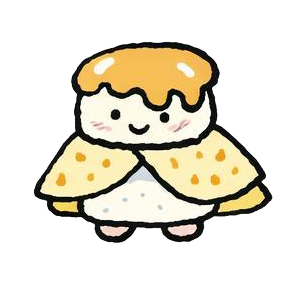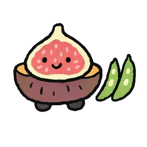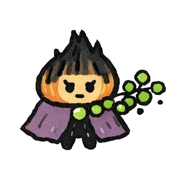
**MWAC**&nbsp;&nbsp;&nbsp;&nbsp;&nbsp;&nbsp;&nbsp;&nbsp;**MWAE**&nbsp;&nbsp;&nbsp;&nbsp;&nbsp;&nbsp;&nbsp;&nbsp;**MWSC**&nbsp;&nbsp;&nbsp;&nbsp;&nbsp;&nbsp;&nbsp;&nbsp;**MWSE**&nbsp;&nbsp;&nbsp;&nbsp;&nbsp;&nbsp;&nbsp;&nbsp;**NBAC**&nbsp;&nbsp;&nbsp;&nbsp;&nbsp;&nbsp;&nbsp;&nbsp;**NBAE**&nbsp;&nbsp;&nbsp;&nbsp;&nbsp;&nbsp;&nbsp;&nbsp;**NBSC**&nbsp;&nbsp;&nbsp;&nbsp;&nbsp;&nbsp;&nbsp;&nbsp;**NBSE**
传统糕点守卫&nbsp;&nbsp;发酵甜品诗人&nbsp;&nbsp;糖霜保守派&nbsp;&nbsp;自然甜心&nbsp;&nbsp;焦麻隐修者&nbsp;&nbsp;震颤苦行僧&nbsp;&nbsp;纯粹苦麻人&nbsp;&nbsp;黑咖麻客

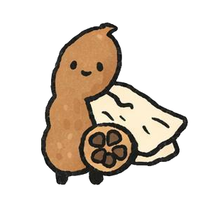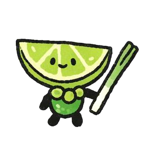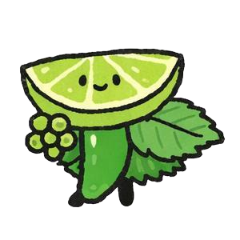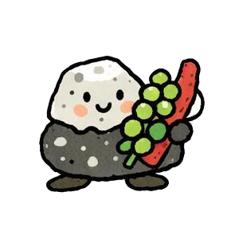
**NOAC**&nbsp;&nbsp;&nbsp;&nbsp;&nbsp;&nbsp;&nbsp;&nbsp;**NOAE**&nbsp;&nbsp;&nbsp;&nbsp;&nbsp;&nbsp;&nbsp;&nbsp;**NOSC**&nbsp;&nbsp;&nbsp;&nbsp;&nbsp;&nbsp;&nbsp;&nbsp;**NOSE**&nbsp;&nbsp;&nbsp;&nbsp;&nbsp;&nbsp;&nbsp;&nbsp;**NSAC**&nbsp;&nbsp;&nbsp;&nbsp;&nbsp;&nbsp;&nbsp;&nbsp;**NSAE**&nbsp;&nbsp;&nbsp;&nbsp;&nbsp;&nbsp;&nbsp;&nbsp;**NSSC**&nbsp;&nbsp;&nbsp;&nbsp;&nbsp;&nbsp;&nbsp;&nbsp;**NSSE**
老坛酸麻守卫&nbsp;&nbsp;酸麻浪人&nbsp;&nbsp;醋麻小清新&nbsp;&nbsp;果酸麻使&nbsp;&nbsp;传统咸麻匠&nbsp;&nbsp;咸麻猎手&nbsp;&nbsp;椒盐原教旨&nbsp;&nbsp;极简麻盐派

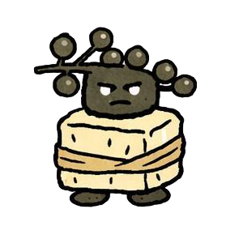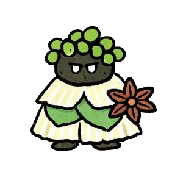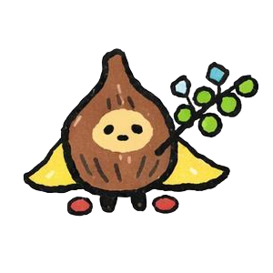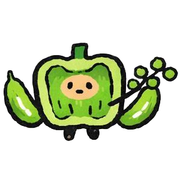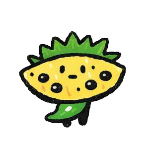
**NUAC**&nbsp;&nbsp;&nbsp;&nbsp;&nbsp;&nbsp;&nbsp;&nbsp;**NUAE**&nbsp;&nbsp;&nbsp;&nbsp;&nbsp;&nbsp;&nbsp;&nbsp;**NUSC**&nbsp;&nbsp;&nbsp;&nbsp;&nbsp;&nbsp;&nbsp;&nbsp;**NUSE**&nbsp;&nbsp;&nbsp;&nbsp;&nbsp;&nbsp;&nbsp;&nbsp;**NWAC**&nbsp;&nbsp;&nbsp;&nbsp;&nbsp;&nbsp;&nbsp;&nbsp;**NWAE**&nbsp;&nbsp;&nbsp;&nbsp;&nbsp;&nbsp;&nbsp;&nbsp;**NWSC**&nbsp;&nbsp;&nbsp;&nbsp;&nbsp;&nbsp;&nbsp;&nbsp;**NWSE**
麻味守门人&nbsp;&nbsp;麻感萨满&nbsp;&nbsp;清麻隐士&nbsp;&nbsp;清麻雅士&nbsp;&nbsp;怪味坚守者&nbsp;&nbsp;甜麻炼金师&nbsp;&nbsp;本甜麻味派&nbsp;&nbsp;果麻探索者

</div>

---

## 功能特性

| 功能 | 说明 |
|:---|:---|
| 🌐 **URL 分享** | 答完题后，URL 自动包含完整结果数据（紧凑编码），分享给朋友可直接查看详细分析 |
| 🖼️ **图片分享** | 生成 3:4 竖版 PNG 分享图，包含头像、类型码、雷达图、堆叠条、QR 码 |
| 📱 **手机分享** | 支持 Web Share API，手机上可分享到微信、相册等 |
| 📊 **详细分析** | 雷达图 + 四维堆叠条可视化，展示你的味觉偏好全貌 |
| ⚡ **纯前端** | 无需后端，无需数据库，纯客户端运行 |
| 🎨 **精美设计** | 温暖的米色系 + 橙棕色点缀，优雅的字体与流畅动画 |

---

## 技术栈

- **HTML5** + **CSS3**（自定义属性设计系统）
- **Vanilla JavaScript**（零依赖 ES Module）
- **Canvas API**（分享图片生成）
- **Web Share API**（手机原生分享）
- **Google Fonts**（Noto Serif SC · Poppins · Lora）

---

## 浏览器兼容性

| 浏览器 | 支持版本 |
|:---|:---|
| Chrome | 80+ |
| Firefox | 75+ |
| Safari | 13+ |
| Edge | 80+ |

> ⚠️ 需要 HTTPS 或 `localhost` 才能使用 Web Share API 和剪贴板功能。

---

## 项目结构

```
FBTI/
├── index.html              # 完整的单文件应用
├── modules/
│   ├── render.js          # 渲染引擎（雷达图、堆叠条、Canvas 绘制）
│   └── scoring.js          # 计分引擎（题目选择、百分比计算、URL 编解码）
├── data/
│   ├── questions.json     # 题库
│   └── types.json          # 80 种人格类型数据
├── assets/
│   ├── FBTI_logo.png      # 品牌 Logo
│   ├── QR.png              # 二维码占位图
│   └── [TYPE].png          # 80 种人格头像（PNG 格式）
├── docs/
│   └── FBTI_3.1_docs/     # 项目文档
└── tests/
    ├── test_scoring.js     # 计分逻辑测试
    └── test_render.js      # 渲染逻辑测试
```

---

## 开发说明

本项目采用 TDD 开发模式，测试驱动确保计分和渲染逻辑正确。

```bash
# 本地运行
python3 -m http.server 8080
# 访问 http://localhost:8080
```

---

<p align="center">
  
  <br>
  <sub>TasteType · 口味人格测试 · 2026</sub>
</p>
