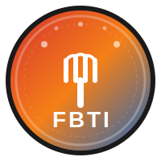

# TasteType · 口味人格测试

<p align="center">
  
</p>

<p align="center">
  <strong>16 道情景题 · 发现你的味觉人格</strong>
</p>

<p align="center">
  <a href="https://github.com/kuicao55/FBTI">
    
  </a>
  
  
</p>

---

## 什么是 TasteType？

TasteType（口味人格测试）是一个 MBTI 风格的食物人格测试，通过 **16 道情景选择题**识别你的四维味觉人格类型。

测试基于四个独立维度构建：

| 维度 | 倾向 A | 倾向 B |
|:---:|:---:|:---:|
| **刺激寻求** | 🌶️ S · 嗜辣 | 🍵 M · 拒辣 |
| **口感执念** | 🥜 C · 嗜脆 | 🍚 W · 嗜软 |
| **风味探索** | 🔮 N · 猎奇 | 📜 T · 经典 |
| **鲜味敏感** | 🫕 U · 嗜鲜 | 🥬 P · 本味 |

> 你可以理解为 **食物版 MBTI** —— 但底层依据的是食品感官科学与口腔行为学。

---

## 16 种味觉人格

<div align="center">

### SCNU · 烈焰暴君

&nbsp;此类型是人类味觉边疆的拓荒者。追求极致的复合型感官轰炸——必须辣到流汗、脆到出声、鲜到掉眉毛。

---

### SCNP · 硬核极客

&nbsp;追求纯粹的化学刺激与物理脆度，但对"鲜"非常苛刻，讨厌味精感。

---

### SCTU · 江湖老饕

&nbsp;地方菜系的坚定捍卫者。只认可"正宗"的辣脆结合，对融合菜嗤之以鼻。

---

### SCTP · 盐系刺客

&nbsp;纯粹的重口味盐分爱好者。比起鲜，更爱直接的咸辣。夜市就是他们的主场。

---

### SWNU · 熔岩核心

&nbsp;渴望"内在的燃烧"。炖得软烂入味的辣卤鸡爪、入口即化的水煮脑花是他们的归宿。

---

### SWNP · 味蕾实验员

&nbsp;为"辣椒冰淇淋"排队的可能就是他们。喜欢新奇辣味带来的趣味性。

---

### SWTU · 红汤居士

&nbsp;四川火锅里的"耙牛肉"是他们的归宿。对"软"和"辣"的比例有严格审美标准。

---

### SWTP · 刺激渴求者

&nbsp;吃辣只是为了爽，为了多巴胺。软糯的麻辣烫宽粉是他们的最爱。

---

### MCNU · 风味猎人

&nbsp;完全不吃辣，但追求极高风味浓度。热爱焦脆的芝士脆皮、美拉德反应极致的煎烤。

---

### MCNP · 清爽极客

&nbsp;喜欢口感上的趣味，但讨厌味道上的负担。"海盐焦糖脆片"是他们的舒适区。

---

### MCTU · 经典脆党

&nbsp;粤菜烧腊的忠实拥趸。烧鹅皮、乳猪皮、炸子鸡皮是他们的灵魂伴侣。

---

### MCTP · 纯粹口感派

&nbsp;只爱吃薯条、炸猪排、脆皮面包。对复杂的调味（哪怕是黑胡椒）都可能排斥。

---

### MWNU · 醇厚鉴赏家

&nbsp;用"软"和"浓"来衡量幸福。热爱提拉米苏、勃艮第红酒炖牛肉、溏心蛋。

---

### MWNP · 轻盈梦想家

&nbsp;追求"空气感"和"温柔的甜/酸"。布丁、慕斯、云朵蛋糕是他们的日常。

---

### MWTU · 怀旧治愈家

&nbsp;"外婆的味道"人格。番茄炒蛋拌饭、红烧肉汁拌饭是他们的comfort food。

---

### MWTP · 极简隐士

&nbsp;饮食世界的"性冷淡风"。白粥配腐乳、白吐司、土豆泥（只放盐）是他们的日常。

</div>

---

## 如何使用

```bash
# 直接在浏览器打开 index.html 即可测试
open index.html

# 或者启动本地服务器（支持 URL 参数分享）
python3 -m http.server 8080
# 然后访问 http://localhost:8080
```

---

## 功能特性

| 功能 | 说明 |
|:---|:---|
| 🌐 **URL 分享** | 答完题后，URL 自动更新为 `?type=SCNU`，分享给朋友可直接查看结果 |
| 🖼️ **图片分享** | 生成 900×1200 的 PNG 分享图，包含头像、类型码、QR 码 |
| 📱 **响应式** | 完美支持 375px（iPhone SE）到 1440px 桌面端 |
| ⚡ **纯前端** | 无需后端，无需数据库，纯客户端运行 |
| 🎨 **Anthropic 设计** | 温暖的米色系 + 橙棕色点缀，优雅的字体与动画 |

---

## 技术栈

- **HTML5** + **CSS3**（自定义属性设计系统）
- **Vanilla JavaScript**（零依赖）
- **Canvas API**（图片生成）
- **QRCode.js**（QR 码生成，CDN）
- **Google Fonts**（Noto Serif SC · Poppins · Lora）

---

## 浏览器兼容性

| 浏览器 | 支持版本 |
|:---|:---|
| Chrome | 80+ |
| Firefox | 75+ |
| Safari | 13+ |
| Edge | 80+ |

> ⚠️ 需要 HTTPS 或 `localhost` 才能使用剪贴板 API 和 QRCode.js CDN。

---

## 项目结构

```
FBTI/
├── index.html          # 完整的单文件应用
├── assets/
│   ├── FBTI_logo.svg  # 品牌 Logo
│   └── *.svg          # 16 型 SVG 头像
├── docs/
│   ├── FBTI_Basic.md   # 味觉人格模型文档
│   ├── FBTI_Questions.md  # 完整题库
│   └── FBTI_SVG.md     # 16 型 SVG 头像图鉴
└── logs/
    └── activity-*.jsonl  # 开发活动日志
```

---

## 开发说明

本项目采用 [super-harness](https://github.com/anthropics/claude-code) 工作流开发。

所有 16 种人格类型、题目、计分逻辑详见 `docs/` 目录。

---

<p align="center">
  
  <br>
  <sub>TasteType · 口味人格测试 · 2026</sub>
</p>
